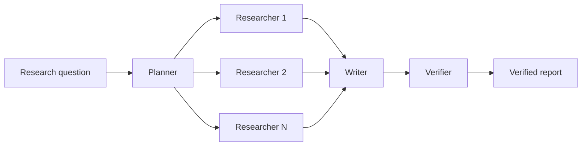

# CiteGuard

CiteGuard is an academic deep-research system under active development. Its goal is to decompose research questions, search arXiv in parallel, produce source-backed reports and independently verify whether report claims are supported by retrieved evidence.

The formal source tree currently contains shared research-domain contracts, an
executable Planner path without memory reuse, and a single-subquestion
Researcher. A formal minimal Temporal Workflow now connects Planner, exactly
one Researcher, deterministic Writer, and deterministic Verifier.

## Documentation

- [Architecture and code guide](CiteGuard_Architecture_and_Code_Guide.pdf):
  rendered 31-page overview of the current modules, contracts, evaluation, and
  minimal Temporal execution results;
- [System map](docs/SYSTEM.md): repository boundary and document router;
- [Implementation status](docs/STATUS.md): implemented, validated, and planned
  capabilities;
- [Design decisions](%E8%AE%A8%E8%AE%BA%E4%B8%8E%E8%AE%BE%E8%AE%A1%E5%86%B3%E7%AD%96%E8%AE%B0%E5%BD%95.md):
  reasoning behind the Planner, Claim/MEG, Writer/Verifier, and Workflow slices.

## Target capabilities

- **Autonomous planning:** Planner decomposes a research topic into independently executable subquestions.
- **Parallel research:** Researcher Agents retrieve and evaluate arXiv papers through MCP.
- **Report synthesis:** Writer combines research results into a structured report with source provenance.
- **Evidence verification:** Verifier checks whether report claims are supported by the retrieved sources.
- **Durable execution:** Temporal preserves completed work and handles bounded retries and recovery.
- **Session memory:** Verified subquestion-level research notes can be reused within the same session.

## Intended workflow



## Technology

- **Python:** primary implementation language for Agents and research workflows;
- **Temporal:** durable orchestration, retries and state recovery;
- **MCP:** connection to arXiv and future research tools;
- **MathMind-RAG:** intended source of reusable grounding and verification behavior.

## Current implementation

- validated Planner Activity input and output contracts;
- strict structured-output schemas for Planner model responses;
- arXiv-only Planner tasks with smallest-sufficient, non-overlapping answer
  requirements and explicit evidence-strength rules for prevalence targets;
- a 4,000-token Planner completion ceiling with malformed-output finish-reason
  diagnostics;
- an OpenRouter boundary restricted to DeepSeek, Qwen and Z.ai GLM models;
- deterministic conversion from model output to domain subquestions;
- a single Researcher that plans bounded arXiv searches, freezes structured
  claims, and searches bottom-up for a minimum-cardinality evidence group;
- explicit evidence statuses and deterministic relevance labels derived from
  factorized per-paper assessments, with a conservative `unknown` abstention;
- a draft Agent Memory dataset and offline metrics for paper relevance,
  group-level support, and minimal evidence-group selection;
- frozen Writer/Verifier boundary contracts with structured report provenance,
  typed verification issues, and tested Temporal serialization;
- a six-case synthetic Writer/Verifier draft fixture covering supported output,
  MEG preservation, provenance errors, overclaiming, and retry localization;
- an independent six-case Writer Gold draft with deterministic structure,
  evidence-state, Claim-coverage, and provenance evaluation;
- a deterministic Writer Activity that emits one attributable statement per
  Researcher Claim and preserves evidence state, ordering, and limitations;
- a deterministic Verifier Activity with scoped Claim/source gates, exact
  evidence-state checks, safe unsupported-text rejection, and retry scope;
- an exactly-one-Researcher Temporal Workflow, production Worker, and client
  with bounded infrastructure retries and normal content-rejection results;
- 117 passing offline tests covering Planner, Researcher, Writer/Verifier,
  Workflow orchestration, domain contracts, evaluation, and style rules;
- a local Temporal smoke covering approval, Verifier rejection, and transient
  Researcher retry with inspectable execution-history counts;
- explicit live Planner and Researcher smoke tests under `tests/live`.

## Planner live-validation status

The no-memory Planner and its arXiv-only/action-free requirement policy have
produced valid live structured outputs. The latest successful reviewed output is
stored in `tmp/planner_arxiv_only_demo.json`; it predates the newer requirement
sufficiency and evidence-ownership rules and is retained as a failure-analysis
example, not Gold.

The strengthened current contract is offline-tested but still awaits a complete
live revalidation. Two 2,500-token attempts returned truncated JSON. Planner now
uses 4,000 completion tokens, but the first request at that budget remained
unresponsive and was terminated without saving partial output.

After completing the editable installation below, run one test module directly:

```powershell
python .\tests\planner\test_activity.py
```

Run the complete formal offline suite:

```powershell
python -m unittest discover -s tests -p "test_*.py" -v
```

Run the review fixture through the Researcher assessment metrics:

```powershell
python -m citeguard.evaluation.runner `
  --dataset eval/datasets/researcher_assessment_draft_v0.json `
  --predictions eval/fixtures/researcher_assessment_predictions_v0.json
```

The bundled assessment dataset is still a human-reviewable, mechanism-only
draft. Its manually authored subquestions are not Planner Gold, and unresolved
paper and evolution-relation labels are listed in the dataset itself. The
fixture validates runner and metric behavior; its score is not a semantic
quality claim about either Planner or Researcher.

The Writer/Verifier fixture lives at
`eval/datasets/writer_verifier_gold_draft_v0.json`. It fixes Researcher results,
Writer coverage expectations, candidate reports, and Gold verification results.
It is synthetic and draft: it supports implementation and regression work, but
does not claim that Verifier or semantic Writer behavior is calibrated.
The real deterministic Verifier runs all six cases: structural cases match
their Gold types, while causal and numeric cases are safely rejected as generic
`unsupported` until a calibrated semantic layer exists.

The Writer-only fixture lives at
`eval/datasets/writer_gold_draft_v0.json`. It covers every Writer v0 evidence
state, new and memory-reused work, zero/one/many Claims, singleton and
multi-source MEGs, and multi-section isolation. Its deterministic evaluator
reports section coverage, Claim recall, provenance precision/recall, evidence
state accuracy, and typed hard-gate failures without judging free-form prose.
All six cases now evaluate the actual deterministic Writer implementation.

## Local development

Requirements: Python 3.10+ and the [Temporal CLI](https://github.com/temporalio/cli/releases).

### Windows PowerShell

```powershell
python -m venv .venv
.\.venv\Scripts\Activate.ps1
python -m pip install -e .
temporal --version
```

### macOS and Linux

```bash
python3 -m venv .venv
source .venv/bin/activate
python -m pip install -e .
temporal --version
```

The editable installation is required by the repository's `src/` layout. It
adds `src/citeguard` to the active virtual environment without copying the
package, so source changes take effect immediately. If the package is not
installed, PowerShell can run a one-off command by setting `PYTHONPATH` first:

```powershell
$env:PYTHONPATH = (Resolve-Path src).Path
python .\tests\planner\test_activity.py
```

Start a local Temporal development server in another terminal:

```bash
temporal server start-dev --ip 127.0.0.1 --db-filename temporal.db
```

The Temporal UI is available at <http://localhost:8233> by default.

Start the production Worker in a second terminal:

```powershell
python -m citeguard.worker
```

Run one minimal Workflow from a third terminal:

```powershell
python -m citeguard.client "What does the evidence show?" `
  --session-id local-session
```

Run the deterministic local Temporal smoke without model or MCP calls:

```powershell
python .\tests\live\temporal_workflow_smoke.py
```
