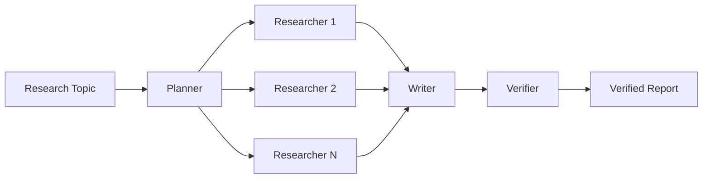

# CiteGuard

CiteGuard 是一个面向学术研究的多 Agent 系统：它能够拆解研究问题、并行检索 arXiv、生成综合报告，并对报告中的结论及其引用进行独立校验。

## 核心能力

- **自主规划**：Planner 将研究主题拆解为可并行执行的子问题。
- **并行调研**：多个 Researcher 通过 MCP 检索并整理 arXiv 论文。
- **报告生成**：Writer 汇总研究结果，形成结构化综合报告。
- **引用校验**：Verifier 复用 MathMind-RAG 的可靠性模块，检查结论是否得到来源支持。
- **持久化执行**：Temporal 负责任务编排、重试与状态恢复，避免长任务因单步失败而从头开始。

## 工作流程



## 技术组成

- **Python**：Agent 与研究流程的主要实现语言
- **Temporal**：长任务编排、状态持久化与失败恢复
- **MCP**：连接 arXiv 等外部研究工具
- **MathMind-RAG**：提供结论溯源与可靠性校验能力

## 本地开发

环境要求：Python 3.10+ 与 [Temporal CLI](https://github.com/temporalio/cli/releases)。Windows 和 Linux 用户可下载对应压缩包，将可执行文件解压到项目外并加入 `PATH`；macOS 用户也可执行 `brew install temporal`。

### Windows PowerShell

```powershell
python -m venv .venv
.\.venv\Scripts\Activate.ps1
pip install -r requirements.txt
temporal --version
```

### macOS / Linux

```bash
python3 -m venv .venv
source .venv/bin/activate
pip install -r requirements.txt
temporal --version
```

另开终端启动本地 Temporal Server：

```bash
temporal server start-dev --db-filename temporal.db
```

Temporal UI 默认地址为 <http://localhost:8233>。
