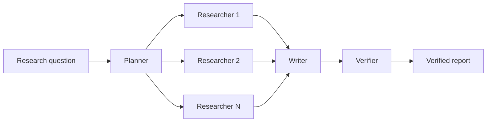

# CiteGuard

CiteGuard is an academic deep-research system under active development. Its goal is to decompose research questions, search arXiv in parallel, produce source-backed reports and independently verify whether report claims are supported by retrieved evidence.

The formal source tree currently contains shared research-domain contracts and
an executable Planner path without memory reuse. The complete business Workflow
is not implemented yet.

## Target capabilities

- **Autonomous planning:** Planner decomposes a research topic into independently executable subquestions.
- **Parallel research:** Researcher Agents retrieve and evaluate arXiv papers through MCP.
- **Report synthesis:** Writer combines research results into a structured report with source provenance.
- **Evidence verification:** Verifier checks whether report claims are supported by the retrieved sources.
- **Durable execution:** Temporal preserves completed work and handles bounded retries and recovery.
- **Session memory:** Verified subquestion-level research notes can be reused within the same session.

## Intended workflow



## Technology

- **Python:** primary implementation language for Agents and research workflows;
- **Temporal:** durable orchestration, retries and state recovery;
- **MCP:** connection to arXiv and future research tools;
- **MathMind-RAG:** intended source of reusable grounding and verification behavior.

## Current implementation

- validated Planner Activity input and output contracts;
- strict structured-output schemas for Planner model responses;
- an OpenRouter boundary restricted to DeepSeek, Qwen and Z.ai GLM models;
- deterministic conversion from model output to domain subquestions;
- offline Planner tests under `tests/planner`;
- an explicit live OpenRouter smoke test under `tests/live`.

After completing the editable installation below, run one test module directly:

```powershell
python .\tests\planner\test_activity.py
```

Run the complete formal offline suite:

```powershell
python -m unittest discover -s tests -p "test_*.py" -v
```

## Local development

Requirements: Python 3.10+ and the [Temporal CLI](https://github.com/temporalio/cli/releases).

### Windows PowerShell

```powershell
python -m venv .venv
.\.venv\Scripts\Activate.ps1
python -m pip install -e .
temporal --version
```

### macOS and Linux

```bash
python3 -m venv .venv
source .venv/bin/activate
python -m pip install -e .
temporal --version
```

The editable installation is required by the repository's `src/` layout. It
adds `src/citeguard` to the active virtual environment without copying the
package, so source changes take effect immediately. If the package is not
installed, PowerShell can run a one-off command by setting `PYTHONPATH` first:

```powershell
$env:PYTHONPATH = (Resolve-Path src).Path
python .\tests\planner\test_activity.py
```

Start a local Temporal development server in another terminal:

```bash
temporal server start-dev --db-filename temporal.db
```

The Temporal UI is available at <http://localhost:8233> by default.
