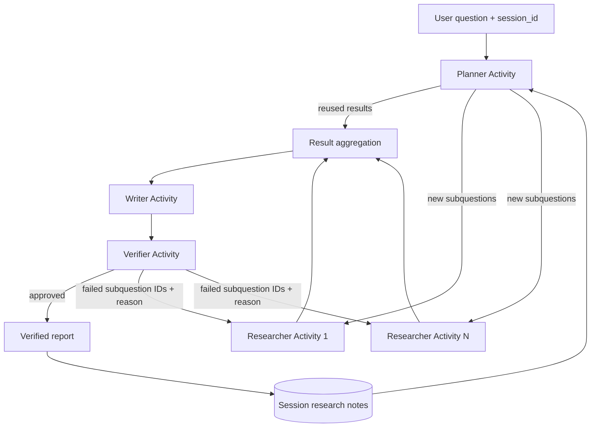

# CiteGuard System Map

> Purpose: the first project-context document for development agents and contributors.
> Updated: 2026-08-28.

## 1. Product boundary

CiteGuard is an academic deep-research system. Given a research question and a session identifier, it is intended to:

1. decompose the question into independently researchable subquestions;
2. reuse compatible research notes from the same session;
3. run the remaining research tasks through arXiv tools;
4. synthesize the results into a report with explicit source provenance;
5. verify that report claims are supported by the retrieved evidence;
6. retry only the failed work while preserving completed work.

The current repository does not yet implement this complete flow. Always check [STATUS.md](STATUS.md) before relying on a planned capability.

## 2. System architecture

The complete run is intended to be one Temporal Workflow. LLM calls, MCP calls, storage and other side effects run in Activities. The Workflow only performs deterministic orchestration over recorded Activity results.

## 3. Component classification

| Component | Classification | Reason |
| --- | --- | --- |
| Planner | Agent | Own reasoning decision: decomposition and memory-reuse choice. |
| Researcher | Agent | Own context, arXiv tool access and research decision. |
| Writer | Node | Fixed aggregation task with no tools or independent execution policy. |
| Verifier | Validation module | Evaluates claim-to-evidence support and identifies failed research scope. |
| Temporal Workflow | Orchestrator | Schedules durable work; it is not an LLM agent. |
| FastAPI/React demo | Interface | Exposes progress and results; it does not make research decisions. |

## 4. Context routing table

| Task or change | Read first | Also inspect |
| --- | --- | --- |
| Code documentation, Tool descriptions or runtime prompt structure | [ENGINEERING.md](ENGINEERING.md) | Owning module document, source and tests |
| Shared DTOs, statuses or invariants | [domain-contracts.md](modules/domain-contracts.md) | All affected module contracts and tests |
| Decomposition, memory reuse or dynamic Researcher count | [planner-memory.md](modules/planner-memory.md) | [domain-contracts.md](modules/domain-contracts.md), [orchestration.md](modules/orchestration.md) |
| Temporal Workflow, Activity boundaries, concurrency or retries | [orchestration.md](modules/orchestration.md) | The business module whose Activity is scheduled |
| Research behavior, arXiv queries or MCP transport | [researcher-arxiv.md](modules/researcher-arxiv.md) | [domain-contracts.md](modules/domain-contracts.md), [orchestration.md](modules/orchestration.md) |
| Report structure, citations, verification or content retry | [report-quality.md](modules/report-quality.md) | [domain-contracts.md](modules/domain-contracts.md), [orchestration.md](modules/orchestration.md) |
| Module metrics, gold datasets, threshold calibration, baselines or end-to-end quality evaluation | [evaluation.md](modules/evaluation.md) | Owning module documents, [domain-contracts.md](modules/domain-contracts.md) |
| API, progress streaming, failure injection or UI | [demo-interface.md](modules/demo-interface.md) | [orchestration.md](modules/orchestration.md), [report-quality.md](modules/report-quality.md) |
| Current progress or next development slice | [STATUS.md](STATUS.md) | Relevant module document and source |
| Product goals and exclusions | [PRODUCT.md](PRODUCT.md) | [STATUS.md](STATUS.md) |
| Historical Temporal/MCP experiment | [archive/README.md](archive/README.md) | `test/mcp_test`, `test/temporal_test` and Git history |

## 5. Strong coupling map

These changes require coordinated review:

| Changed concept | Required review scope |
| --- | --- |
| `SubQuestionStatus` | Domain contracts, Planner prompts/schemas, memory behavior, Workflow routing and tests |
| Planner output shape | Planner, domain contracts, Workflow scheduling and UI plan display |
| Fixed answer target or requirements | Planner, Researcher Claim generation, MEG Eval and Memory reuse |
| Research result/source shape | Researcher, Writer, Verifier, memory persistence and report UI |
| Claim provenance | Writer, Verifier, content retry and report UI |
| MEG support policy | Researcher runtime, Gold group labels, evidence status and Eval metrics |
| `failed_sub_question_ids` | Verifier, Workflow retry selection and Researcher feedback input |
| Activity boundary or retry policy | Workflow, Worker registration, affected Activity and progress reporting |

## 6. Source-of-truth order

Use the following precedence when documents disagree:

1. executable source code and tests describe current behavior;
2. the relevant module document describes the accepted design;
3. [STATUS.md](STATUS.md) describes implementation progress;
4. [PRODUCT.md](PRODUCT.md) describes product intent;
5. archived spike documents describe historical experiments only.

Do not silently resolve a mismatch. Record it in `STATUS.md` and update the affected document or implementation as part of the same scoped task.

## 7. Development direction

Development proceeds through the smallest working vertical slice, then adds one capability at a time. This document owns that stable rule, while [STATUS.md](STATUS.md) owns the ordered roadmap, current step and completion criteria because those details change as implementation progresses.

## 8. Change history

| Date | Change |
| --- | --- |
| 2026-08-28 | Implemented the first formal end-to-end Temporal Workflow with exactly one Researcher and explicit infrastructure/content-failure separation. |
| 2026-08-27 | Froze the project-owned Writer/Verifier boundary over the existing Researcher Claim and MEG contract. |
| 2026-08-26 | Added fixed answer-target and MEG policy coupling routes after the Researcher Claim/MEG contract was implemented. |
| 2026-08-24 | Added the cross-module evaluation design route while keeping module-specific quality responsibilities in their owning documents. |
| 2026-08-23 | Added `ENGINEERING.md` as the routed source of truth for structured code and Tool documentation. |
| 2026-08-23 | Moved the changing development sequence fully into `STATUS.md` and retained only the stable incremental-delivery rule here. |
| 2026-08-23 | Established the system map, module router, coupling map and source-of-truth order. |
